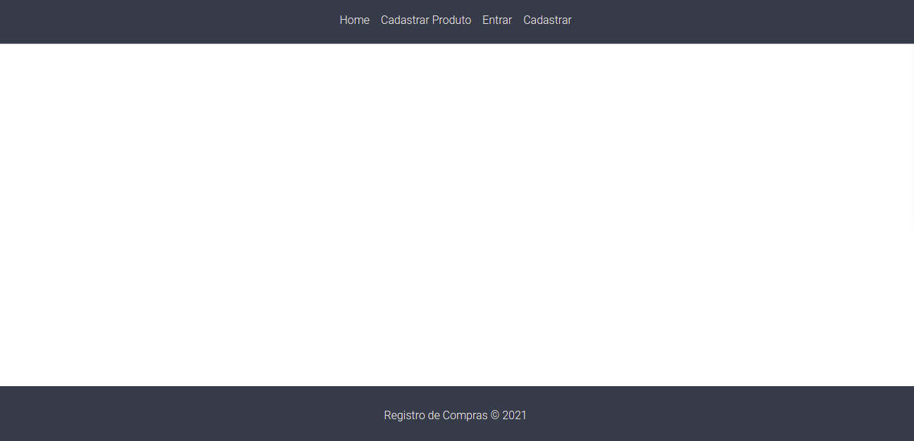

<h1 align="center">
    
    <p>Evite acúmulo de papéis desnecessários e faça uma gestão inteligente de suas aquisições materiais! 🗃🗃</p>
</h1>

## 🏮 Sobre

**Registro de Compras** é um projeto que visa armazenar registros de compras realizadas (nome do produto, categoria, valor, estabelecimento de compra, data de compra, imagem da nota fiscal, tempo de garantia) e com isso tem o intuito de gerar um histórico aonde o usuário pode verificar quais de seus bens ainda estão no prazo de garantia e caso necessite consegue facilmente acessar sua nota fiscal e detalhes sobre o produto não tendo que se preocupar com armazenamento de papeis e anotações.

---

## 🖥 Requisitos

- [PHP 7+](https://www.php.net/downloads)
- [Composer](https://getcomposer.org/download/)
- [Laravel 8+](https://laravel.com/docs/4.2/installation#install-laravel)
- Servidor HTTP com suporte ao PHP (ex: Apache, Nginx, Caddy, ..)
- Um banco de dados: MySQL, PostgreSQL, SQLite, ...

---

## 📂 Como baixar o projeto

```bash 
  # Clonar o projeto
  $ git clone https://github.com/murilo2001/registro-de-compras.git
````

```bash 
  # Acessar diretório
  $ cd registro-de-compras
````

```bash 
  # Instale as dependências, caso usar npm
  $ npm install
````

<p align="center">ou</p>

```bash 
  # Instale as dependências, caso usar yarn
  $ yarn start
````
---

## 📄 Licença
Este projeto está sob a [MIT license](https://opensource.org/licenses/MIT). Veja o arquivo LICENÇA para maiores detalhes.
